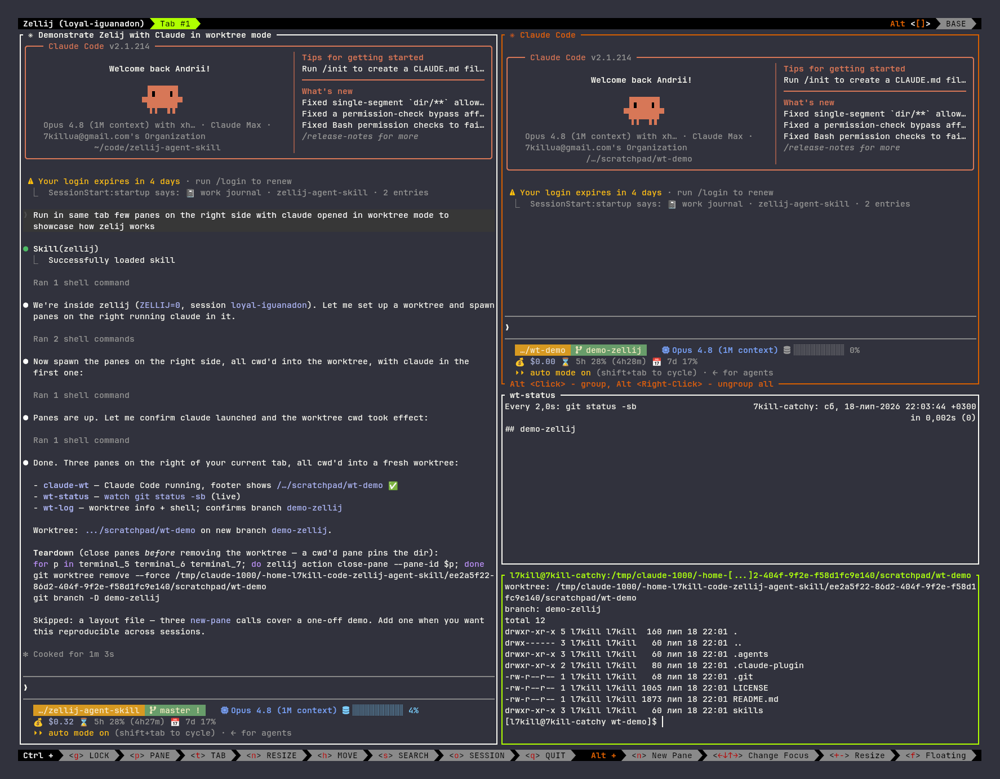

# zellij-agent-skill

An [Agent Skill](https://code.claude.com/docs/en/skills) that teaches a coding
agent to drive the [zellij](https://zellij.dev) terminal multiplexer from the
CLI — park long-lived jobs (dev servers, build/test watchers, log tails) in
their own **visible** pane instead of burying output in tool results, read a
pane back with `dump-screen`, and manage tabs/panes/worktrees.



It is **self-gating**: the first thing it does is check `$ZELLIJ`. Outside a
zellij session it tells the agent to fall back to a normal background job and
stop — so it costs nothing when you're not in zellij, and never hijacks a plain
terminal.

The skill format is portable, so the same `skills/zellij/SKILL.md` works in
**Claude Code** and **OpenAI Codex** unchanged. It is the single source of
truth; the `.agents/skills/zellij` entry is a symlink to it for Codex.

## When it fires

The agent consults the skill on its own for anything multiplexer-shaped:

- panes/tabs/splits/floating panes/sessions/layouts
- "watch/monitor/tail this log (or job, or process) on the side"
- before launching a long-running or background process (dev server, build, watcher)
- git worktree work, and orchestrating visible Claude Code or Codex agents
  across worktrees

Triggering is fuzzy — a prompt that doesn't name zellij may not fire it. To
**force** it, add `use zellij` to your prompt. Example prompts:

```
run the dev server in a pane and tell me when it's listening
tail the test watcher on the side while we work
spawn one Claude and one Codex worktree agent in visible panes — use zellij
open a floating pane with the build output
```

It self-gates: outside a zellij session it falls back to a normal background
job, so `use zellij` costs nothing when you're not in one.

For worktree agents, the skill teaches a pure-CLI recipe — no bundled
binary, no runtime dependency. One git worktree plus one named, suspended
zellij pane per agent; the prompt carries a bounded task, a no-recursion
guard, and a done marker; monitoring is event-driven via `zellij subscribe`;
teardown closes panes before removing worktrees. Placement (current tab, one
shared tab, or a tab per agent) is asked explicitly because it decides what
gets closed later. Models are never the skill's business — each agent CLI
launches with its own configured default. Recipes:
[skills/zellij/references/agent-runs.md](skills/zellij/references/agent-runs.md).

## Install — one line

Via the [skills CLI](https://skills.sh) (`-g` = user-level; omit for
project-level):

```sh
npx -y skills add 7KiLL/zellij-agent-skill --skill zellij --agent claude-code -g
```

Same for Codex — or any agent the CLI supports (`--agent '*'` for all):

```sh
npx -y skills add 7KiLL/zellij-agent-skill --skill zellij --agent codex -g
```

## Install — Claude Code (plugin marketplace)

```
/plugin marketplace add 7KiLL/zellij-agent-skill
/plugin install zellij@l7kill-plugins
```

Or drop just the skill in without any machinery:

```sh
cp -r skills/zellij ~/.claude/skills/zellij
```

## Install — OpenAI Codex

Codex reads the same format from `~/.agents/skills/` (personal) or
`<repo>/.agents/skills/` (project):

```sh
cp -r skills/zellij ~/.agents/skills/zellij   # personal, any repo
```

Then run `/skills` inside Codex to confirm it's listed. Working *inside this
repo* with Codex needs no install — `.agents/skills/zellij` already points at
the skill.

## Layout

```
.claude-plugin/
  plugin.json          # Claude Code plugin manifest
  marketplace.json     # marketplace catalog (repo is its own marketplace)
skills/
  zellij/
    SKILL.md           # concise workflow — single source of truth
    references/cli.md       # zellij CLI cheat sheet
    references/sessions.md  # session organization: naming, tagging, surfaces
    references/agent-runs.md  # agent fan-out recipes (plain CLI)
.agents/
  skills/zellij -> ../../skills/zellij   # symlink, for Codex in-repo discovery
```

## License

MIT — see [LICENSE](LICENSE).
